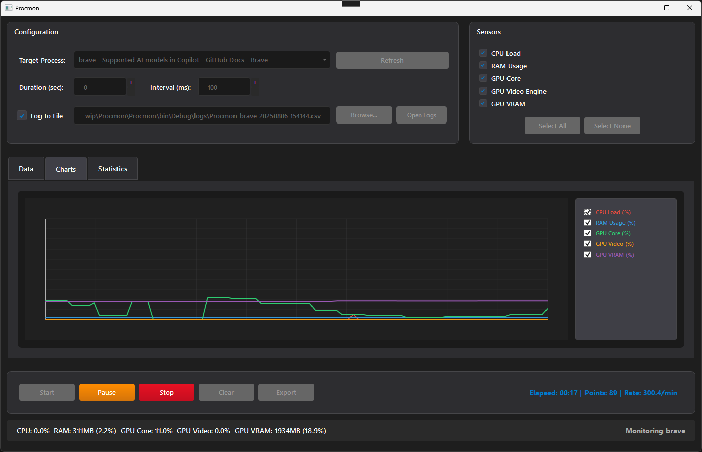

# Procmon: Process Performance Monitor

Procmon is a .NET Framework 4.8 WPF application that provides real-time monitoring of system performance metrics including CPU, RAM, and GPU usage. The application features both a graphical interface and command-line operation modes.


*Procmon's main view with real-time performance chart.*

## Features

### Core Monitoring Capabilities
- **CPU Usage**: Process-specific CPU utilization monitoring
- **RAM Usage**: Memory consumption tracking (both absolute and percentage)
- **GPU Core Usage**: Graphics processing unit core utilization
- **GPU Video Engine**: Video encoding/decoding engine utilization
- **GPU VRAM Usage**: Video memory consumption tracking

### Advanced NVIDIA GPU Support
The application now includes enhanced NVIDIA GPU monitoring using the NVIDIA Management Library (NVML) with intelligent fallback mechanisms:

#### NVML Integration
- **Direct NVIDIA Access**: Uses NVIDIA's official NVML (NVIDIA Management Library) for accurate GPU metrics
- **Real VRAM Detection**: Automatically detects actual GPU memory size instead of using estimates
- **Comprehensive GPU Data**: Access to detailed GPU utilization, memory usage, and encoder/decoder statistics
- **Multi-GPU Aware**: Designed to support multiple NVIDIA GPUs (currently uses first detected GPU)

#### Fallback Mechanisms
- **Performance Counter Fallback**: Automatically falls back to Windows Performance Counters if NVML is unavailable
- **Error Resilience**: Graceful handling of missing drivers or unsupported hardware
- **Compatibility**: Works on systems without NVIDIA GPUs or with older driver versions

### User Interface
- **Real-time Charts**: Live performance visualization
- **Statistics Panel**: Min/max/average calculations
- **Process Selection**: Easy switching between monitored processes
- **Settings Configuration**: Customizable monitoring intervals and sensors

### Data Export & Logging
- **CSV Export**: Export collected data to CSV format
- **Real-time Logging**: Continuous logging to file during monitoring
- **Automatic Log Organization**: Logs saved to dedicated `logs/` directory
- **Timestamped Files**: Automatic filename generation with timestamps

### Dual Operation Modes
- **GUI Mode**: Full graphical interface with charts and statistics
- **Console Mode**: Command-line operation for automation and scripting

## NVIDIA GPU Requirements

### Supported Systems
- **NVIDIA GPUs**: GeForce, Quadro, Tesla, or RTX series
- **Driver Version**: NVIDIA drivers with NVML support (typically 385.54 or newer)
- **Operating System**: Windows with appropriate NVIDIA drivers installed

### NVML Dependencies
The application requires the NVIDIA Management Library (NVML) for enhanced GPU monitoring:
- **Library**: `nvml.dll` (included with NVIDIA drivers)
- **Location**: Typically installed in `C:\Program Files\NVIDIA Corporation\NVSMI\` or system PATH
- **Fallback**: Application automatically falls back to Windows Performance Counters if NVML is unavailable

### Detection and Diagnostics
The application includes automatic NVIDIA GPU detection and diagnostic information:
- Detects available NVIDIA GPUs on startup
- Reports GPU model and VRAM capacity
- Logs diagnostic information to help troubleshoot issues
- Provides clear error messages for missing drivers or hardware

## Installation

### Prerequisites
- **.NET Framework 4.8** or higher
- **Windows OS** with appropriate GPU drivers
- **NVIDIA Drivers** (for enhanced GPU monitoring)

### Setup
1. **Extract Application**: Extract all files to desired directory
2. **Install Dependencies**: Ensure .NET Framework 4.8 is installed
3. **GPU Drivers**: Install latest NVIDIA drivers for optimal GPU monitoring
4. **Permissions**: Run with appropriate permissions for process monitoring

## Usage

### GUI Mode
1. **Launch Application**: Run `Procmon.exe` without arguments
2. **Select Process**: Choose target process from dropdown
3. **Configure Settings**: Adjust monitoring interval, duration, and sensors
4. **Start Monitoring**: Click "Start" to begin data collection
5. **View Results**: Monitor real-time charts and statistics
6. **Export Data**: Save collected data to CSV format

### Console Mode
```bash
# Basic monitoring with verbose output
Procmon.exe -v notepad

# Monitor for specific duration with custom interval
Procmon.exe -d 300 -i 1000 chrome

# Custom log file location
Procmon.exe -f "custom-log.csv" -v firefox

# Show help
Procmon.exe -h
```

### Command Line Options
- `-d, --duration <seconds>`: Monitoring duration (0 for infinite)
- `-i, --interval <milliseconds>`: Data collection interval
- `-f, --filename <path>`: Custom log file location
- `-v, --verbose`: Display output to console
- `-h, --help`: Show usage information

## Configuration

### Monitoring Settings
- **Duration**: Set monitoring time limit or run indefinitely
- **Interval**: Adjust data collection frequency (minimum 10ms)
- **Sensors**: Enable/disable specific monitoring components
- **Logging**: Configure automatic file logging

### File Organization
- **Logs Directory**: All log files saved to `logs/` subdirectory
- **Automatic Creation**: Log directory created automatically at startup
- **File Naming**: Automatic timestamped filename generation
- **Process-Specific**: Log files include monitored process name

## Technical Details

### Architecture
- **MVVM Pattern**: Clean separation of UI and business logic
- **Service Layer**: Modular sensor and data management
- **Async Operations**: Non-blocking UI with proper threading
- **Resource Management**: Automatic cleanup and disposal

### NVIDIA Sensor Implementation
- **Primary Sensors**: NVML-based sensors in `Sensors\Nvidia\` namespace
- **Wrapper Sensors**: Main GPU sensors with automatic fallback logic
- **Interop Layer**: P/Invoke declarations for NVML functions
- **Detection Utilities**: GPU capability detection and diagnostics

### Performance Considerations
- **Efficient Data Collection**: Optimized sensor polling
- **Memory Management**: Circular buffer for chart data
- **Thread Safety**: Proper synchronization for multi-threaded access
- **Resource Cleanup**: Automatic disposal of sensors and services

## Troubleshooting

### NVIDIA GPU Issues
**Problem**: GPU sensors show zero values
**Solutions**:
- Verify NVIDIA drivers are installed and up-to-date
- Check that NVML is available (usually installed with drivers)
- Run application with administrator privileges if needed
- Check Windows Event Log for detailed error messages

**Problem**: NVML initialization fails
**Solutions**:
- Ensure NVIDIA GPU is properly detected by Windows
- Update to latest NVIDIA drivers
- Verify `nvml.dll` is accessible in system PATH
- Application will automatically fall back to Performance Counters

### General Troubleshooting
**Problem**: Process access denied
**Solutions**:
- Run application as administrator
- Select processes with visible windows
- Ensure target process is not protected by system security

**Problem**: Performance counters unavailable
**Solutions**:
- Verify Windows Performance Counters are enabled
- Run `lodctr /R` to rebuild counter registry (as admin)
- Restart Windows Management Instrumentation service

## File Structure

```
Procmon/
    Procmon.exe                         # Main application
    logs/                               # Auto-created log directory
    Sensors/
        CpuSensor.cs                    # CPU monitoring
        RamSensor.cs                    # Memory monitoring
        GpuCoreSensor.cs                # GPU core (with NVIDIA support)
        GpuVideoSensor.cs               # GPU video engine
        GpuVramSensor.cs                # GPU memory
        Nvidia/                         # NVIDIA-specific implementations
            NvidiaGpuCoreSensor.cs
            NvidiaGpuVideoSensor.cs
            NvidiaGpuVramSensor.cs
            NvmlInterop.cs              # NVML P/Invoke definitions
            NvidiaDetection.cs          # GPU detection utilities
    Services/                           # Core services
    ViewModels/                         # MVVM view models
    Views/                              # WPF user interface
    Models/                             # Data models
```

## Version History

### Latest Version
- **Enhanced NVIDIA Support**: Added NVML-based GPU monitoring with fallback
- **Improved VRAM Detection**: Real GPU memory size detection
- **Better Error Handling**: Graceful fallback for unsupported hardware
- **Automatic Log Directory**: Logs folder created at startup
- **Diagnostic Information**: GPU detection and capability reporting

## Support

For issues, feature requests, or questions:
1. Check the troubleshooting section above
2. Review Windows Event Log for detailed error messages
3. Verify system requirements and dependencies
4. Test with administrator privileges if needed

## License

This project is provided as-is for educational and monitoring purposes.
